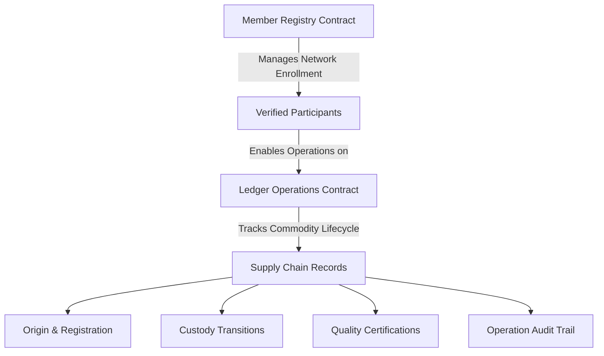

# Agri-Ledger Network

A decentralized agricultural supply chain ledger built on Stacks, enabling transparent tracking and verification of commodities from origin through final distribution.

## Overview

Agri-Ledger Network establishes a verified network of agricultural actors who collectively maintain immutable records of product movement, quality certifications, and handling operations. The platform empowers:

- Growers to register and track commodity origins
- Logistics and processing entities to document handling activities
- Certification bodies to issue quality verifications
- All participants to access transparent audit trails

## System Architecture

Two complementary contracts orchestrate the network's functionality:



### Member Registry Contract
- Network member enrollment and verification
- Tier-based access control (grower, logistics, processor, retailer)
- Endorser authorization and governance roles
- Member status lifecycle management

### Ledger Operations Contract
- Commodity lifecycle management (creation through finalization)
- Custody transfer and chain-of-custody tracking
- Quality certification issuance and validation
- Immutable audit logs of all supply chain operations

## Contract Features

### Member Registry

Core functionality for network participation:

#### Key Operations:
- `enroll-member`: Self-registration with network tier selection
- `certify-member`: Endorser verification of member eligibility
- `set-member-state`: Status management (certified, restricted, inactive)
- `update-member-profile`: Profile information updates

#### Member Tiers:
- Grower (tier 1)
- Logistics (tier 2)
- Processor/Transformer (tier 3)
- Retailer (tier 4)
- Endorser (tier 5)
- Governance (tier 6)

#### Member States:
- Applicant (pending verification)
- Certified (verified and operational)
- Restricted (suspended from operations)
- Inactive (deactivated)

### Ledger Operations

Complete commodity lifecycle management:

#### Key Operations:
- `create-commodity`: Register new product with origin information
- `exchange-custody`: Transfer custody between supply chain participants
- `issue-qualification`: Issue quality certification
- `log-operation`: Record handling activity
- `finalize-commodity`: Mark end of supply chain journey

#### Data Structures:
- Unique commodity identifiers with auto-increment
- Handler/custodian tracking
- Multi-type qualification support
- Comprehensive operation audit logs with timestamps and location

## Installation & Setup

### Prerequisites
- Clarinet (2.0 or higher)
- Node.js 16+
- Stacks wallet

### Quick Start

1. Clone and navigate to repository:
```bash
git clone <repository-url>
cd agri-ledger-network
npm install
```

2. Start local development chain:
```bash
clarinet integrate
```

3. Deploy contracts to testnet or mainnet as needed

## API Reference

### Member Registry Contract

Register as network member:
```clarity
(contract-call? .member-registry enroll-member
    (string-utf8 "Sunrise Farms LLC")
    u1
    (string-utf8 "Iowa, USA")
    (string-utf8 "Organic grain producer"))
```

Verify member enrollment (endorser):
```clarity
(contract-call? .member-registry certify-member 'SP2J6ZY48GV6RRZJ8QC5ZCH9DQKK4XJHD4WSJF0W1)
```

### Ledger Operations Contract

Register new commodity:
```clarity
(contract-call? .ledger-operations create-commodity
    (string-ascii "Winter Wheat")
    u1706745600)
```

Transfer custody:
```clarity
(contract-call? .ledger-operations exchange-custody
    u0
    'SP1CERTIFYING0ENTITY0000000000000000000000
    (string-utf8 "Transferred for processing")
    (some (string-ascii "Processing Facility A, Illinois")))
```

Add quality certification:
```clarity
(contract-call? .ledger-operations issue-qualification
    u0
    (string-ascii "organic-certified")
    u1737340800
    (string-utf8 "USDA Organic certification validated"))
```

## Development & Testing

### Run Test Suite
```bash
clarinet test
```

### Local Contract Interaction
```bash
clarinet console
```

Then interact with contracts directly in REPL.

## Security Architecture

### Network Verification
- Tier-based role enforcement prevents unauthorized operations
- Member certification gates access to ledger operations
- Endorser network maintains integrity of member roster

### Operational Security
- Custody verification prevents unauthorized product transfers
- Certification authority validation ensures quality claim legitimacy
- Immutable audit trails provide forensic capability

### Design Constraints
- All data is transparent on-chain; sensitive information should not be directly stored
- Network relies on external identity verification (endorsers must vet members)
- Commodity identifiers are sequential; traceability depends on accurate operation logging